## Oracle Cloud Tutorial

### Register for an Oracle Cloud Account

Open your web browser and go to the official Oracle Cloud website: https://www.oracle.com/cloud/free/?intcmp=ohp052322ocift

**1. Click on Start for Free**

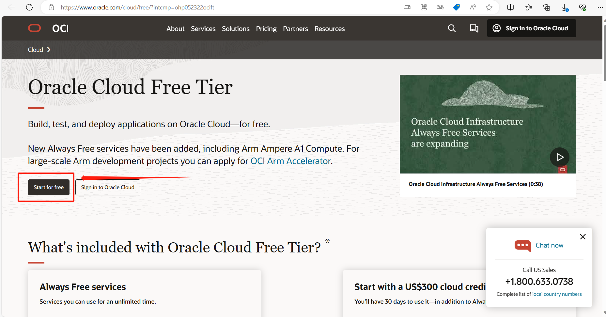

**2. Fill in the registration information**

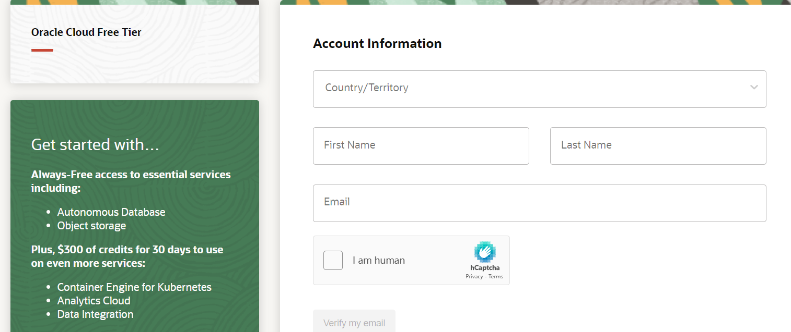

Enter your email address and password. Fill in your personal information, including your name, company name, and so on. Read and accept Oracle's Service Agreement and Privacy Policy.

**3. Verify your email address**

Oracle Cloud will send a verification email to the email address you provided. Please log in to your email account, locate the email and click on the verification link to continue the registration process.

**4. Fill in payment information**

If you choose to sign up for a paid account, you will need to provide payment information, such as credit card information. If you choose to sign up for a free trial, payment information is usually not required.

**5. Complete Registration**

Once you have completed all the steps and verified your information, your Oracle Cloud account is created. You will be able to log in to the Oracle Cloud console and start using the cloud services.

Please note that Oracle Cloud offers a number of free trial services and packages, but some premium services may incur a fee. Be sure to review pricing and cost-related information before using Oracle Cloud services to avoid unexpected charges. After you sign up for an Oracle Cloud account, you can use the console to manage and monitor your cloud resources. If you need additional help or support, you can find documentation and support resources on the Oracle Cloud website.

### Log into Oracle Cloud Console

On the login page, enter the email and password you registered with. Authenticate further if two-factor authentication is set up.

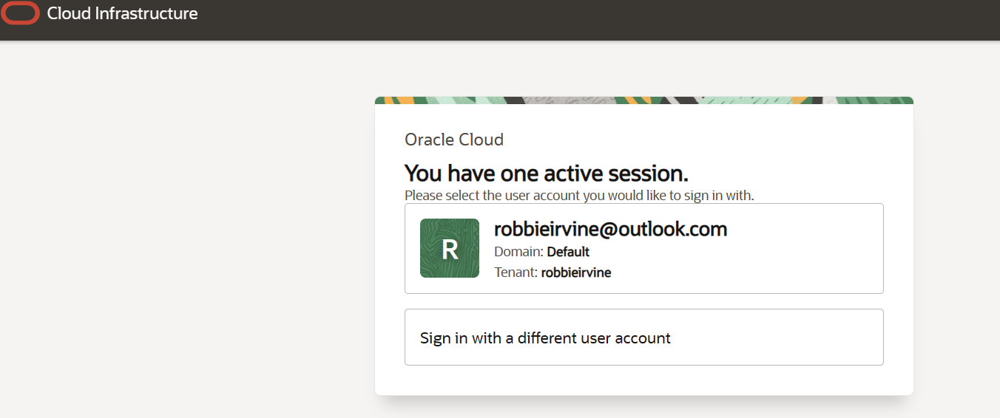

### Create an Autonomous Database Instance

From the main dashboard, find and click on Autonomous Database.

**Begin Configuration**

Click on Create or New to start creating a new database instance.

**Fill Out Database Details**

Display Name and Database Name: Input a unique name for the database, e.g., GroupK.

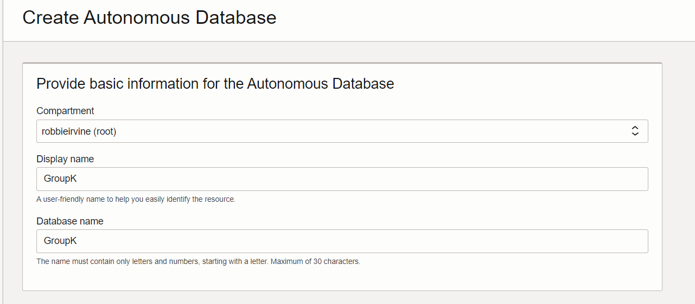

**Choose workload type:**

Select Transaction Processing or Data Warehouse, depending on your needs.

1. Data Warehouse:
Opt for this when you need to store, query, and analyze large datasets to derive business insights, such as performing intricate analysis on historical sales data to predict future trends.
2. Transaction Processing:
Ideal for applications that require frequent, low-latency interactions, like online retail sites, banking transaction systems, or any other transaction-intensive applications.
3. JSON:
 When your application is predominantly based on JSON data and requires flexibility to accommodate frequent changes in data structures. Examples include backends for mobile apps, content management systems, or real-time event processing.
4. APEX:
When you need to swiftly develop and deploy web apps without writing extensive code. It's especially suitable for SMEs and department-level app developments.

**Choose deployment Type:**

1. Serverless:
When your workload has irregular usage patterns, or you want to minimize costs and pay per actual usage. Examples include development and testing environments, seasonal business apps, or applications for startups.
2. Dedicated infrastructure:
When you require consistent high performance, predictable resources, and isolated network, storage, and compute. Particularly apt for enterprise-level apps, mission-critical apps, or applications that need to meet specific compliance requirements.

Choosing the appropriate workload and deployment type ensures that your database meets the demands for performance, cost, and availability. I hope this information assists you in making an informed decision!

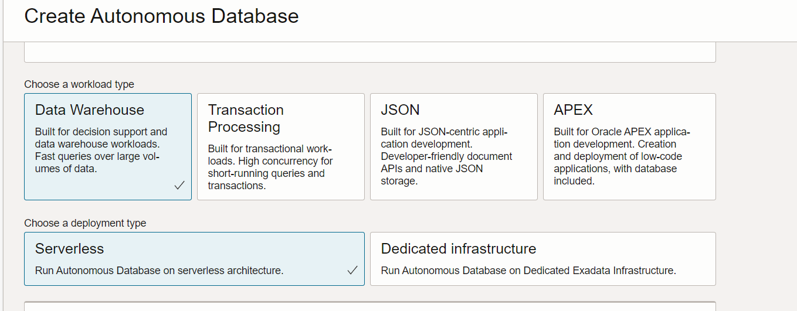

**Choose backup retention:**

In Oracle Cloud Database Service, "Backup Retention" is the period of time for which database backups are automatically retained. As shown in the figure, the backup retention period is set to 60 days, which means that the system will automatically keep the most recent backup files, and these backup files will be retained for up to 60 days, and backup files older than 60 days will be deleted automatically.

This setting is important for data recovery and protection. By setting the backup retention period, you can ensure that database backups are available for 60 days so that you can restore the database to a previous state if needed. This helps protect data from unexpected data loss or database problems.

In Oracle Cloud Database Service, you can usually configure the backup retention period to suit your needs. This setting can be configured and managed in the administration console of the database service to ensure that your database backup policy meets your business needs and compliance requirements. When the backup retention period expires, old backup files are automatically deleted to free up storage space and maintain backup file management.

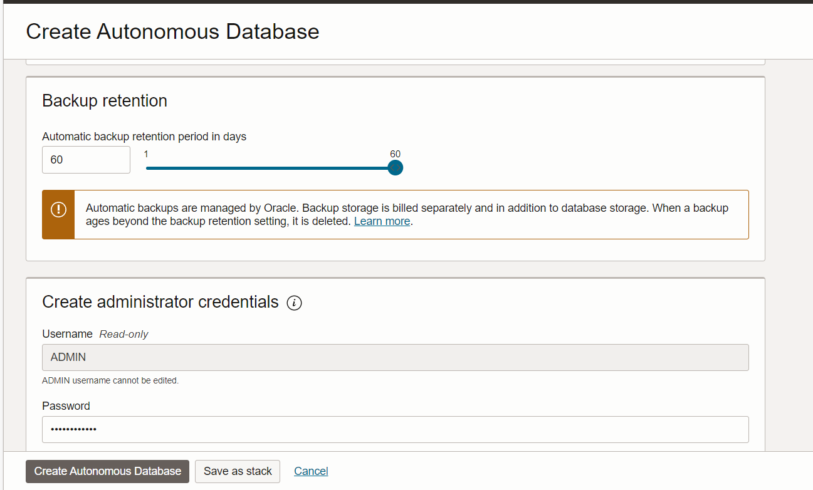

**Create administrator credentials:**

Set Username and password. Set a secure password, make sure to remember or store it safely.

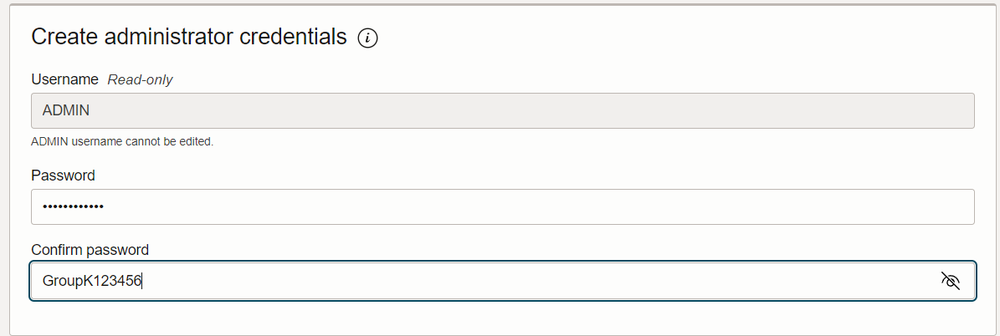

**Choose network access:**

1. Secure access from everywhere
When you select this option, the database allows any user with database credentials (username, password, etc.) to access it from anywhere on the Internet. This means that the database is publicly accessible, but you need to ensure that the database credentials are secure to prevent unauthorised access. This option is suitable for certain situations where broad public access is required, but needs to be carefully configured to ensure security.

2. Secure access from allowed IPs and VCNs only
When you select this option, the database allows access only from specified IP addresses and Virtual Cloud Networks (VCNs). This provides tighter access control so that only resources in pre-authorised IP addresses or VCNs can access the database. This option is useful in situations where you need to restrict access to a specific IP range or a specific VCN to improve security.

3. Private endpoint access only
When you select this option, the database is only allowed to be accessed over a private network within OCI (Oracle Cloud Infrastructure). This means that the database will not be publicly visible on the Internet and will only be accessible to other resources located in the same VCN or through network connections between VCNs. This option provides the highest level of security and is typically used in situations where database access requirements are very stringent, such as applications that require complete isolation and privacy.

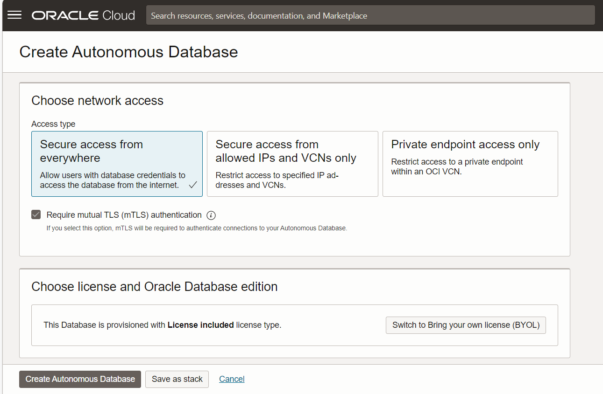

**Finalize and Deploy**

Review all the information and ensure they're correct. Then click on Create. Wait for the database instance to be created. This might take several minutes.

Once done we can see what the image below shows.

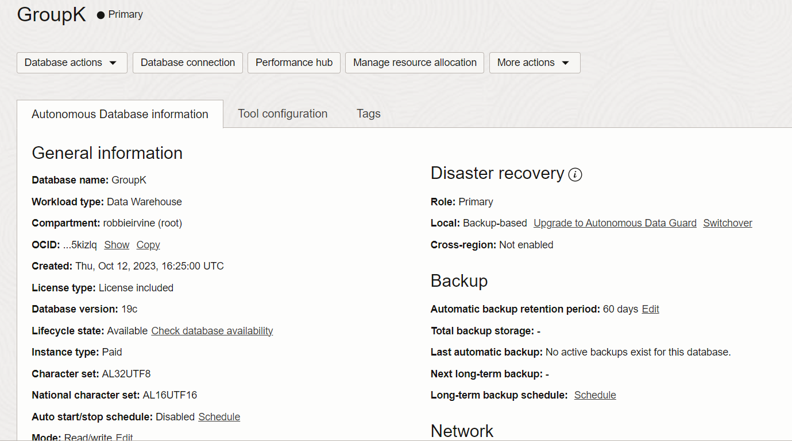

### Create tables in the database

In GroupK database, we have created two tables.One table is named PRODUCTS, this table contains four columns product_id, name, description, price. where product_id is the primary key.

SQL statement is as follows:

```sql
CREATE TABLE PRODUCTS (
    PRODUCT_ID NUMBER NOT NULL,
    NAME VARCHAR2(100 BYTE),
    DESCRIPTION VARCHAR2(255 BYTE),
    PRICE NUMBER(10,2),
    CONSTRAINT PK_PRODUCTS PRIMARY KEY (PRODUCT_ID)
);
```

The other one is named INVENTORY, where INVENTORY_id is the primary key and PRODUCT_ID is the foreign key pointing to the PRODUCT_ID field of the PRODUCTS table.

SQL statement is as follows:

```sql
CREATE TABLE INVENTORY (
    INVENTORY_ID NUMBER NOT NULL,
    PRODUCT_ID NUMBER,
    QUANTITY NUMBER,
    ENTRY_DATE DATE,
    CONSTRAINT PK_INVENTORY PRIMARY KEY (INVENTORY_ID),
    CONSTRAINT FK_INVENTORY_PROD FOREIGN KEY (PRODUCT_ID) REFERENCES PRODUCTS(PRODUCT_ID) ON DELETE NO ACTION
);
```
Insert some simple data into the above table.
```sql
INSERT INTO PRODUCTS (PRODUCT_ID, NAME, DESCRIPTION, PRICE) VALUES 
(1, 'Apple', 'Fresh and crisp apple', 1.99),
(3, 'Orange', 'Juicy and delicious or', 1.49),
(4, 'Milk', 'Whole milk, one gallc', 3.99),
(5, 'Bread', 'Freshly baked bread', 2.49),
(2, 'Banana', 'Ripe and sweet banar', 0.99);

INSERT INTO INVENTORY (INVENTORY_ID, PRODUCT_ID, QUANTITY, ENTRY_DATE) VALUES 
(102, 2, 150, '10/6/2023 12:00:00 AM'),
(104, 4, 50, '10/8/2023 12:00:00 AM'),
(101, 1, 200, '10/5/2023 12:00:00 AM'),
(103, 3, 100, '10/7/2023 12:00:00 AM'),
(105, 5, 75, '10/9/2023 12:00:00 AM');

```
### Connecting to database code

Connecting to Oracle Cloud's database using JavaScript usually involves using Node.js and the corresponding Oracle driver. Here is a detailed tutorial on connecting to an Oracle Cloud database using the oracledb module for Node.js.

**1. Download and Use Database Connection Wallet**
Once the database instance status shows as Available, click on the instance name to go to its details. Under the DB Connection section, click on Download to get the connection Wallet.

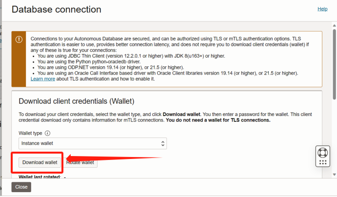


**2. Preparing the Environment**
Make sure you have Node.js and npm installed on your system.

**3. Installing the oracledb module**
Run the following command in your project folder to install the oracledb module:

```code
npm install oracledb
```

**4. Download Oracle Instant Client**

In order for oracleb to work properly, you will need to download and configure the Oracle Instant Client, please go to the official Oracle website to download the appropriate Oracle Instant Client according to your operating system and Oracle database version.

**5. Setting environment variables**

Set the LD_LIBRARY_PATH (Linux) or PATH (Windows) environment variable to contain the directory for Oracle Instant Client.

**6. Write code to connect to the database**

Create a new JavaScript file, such as connect.js, and add the following:

```javascript
const oracledb = require('oracledb');

async function run() {
    let connection;

    try {
        connection = await oracledb.getConnection({
            user: "YOUR_USERNAME",
            password: "YOUR_PASSWORD",
            connectString: "YOUR_ORACLE_CLOUD_CONNECTION_STRING"
        });

        console.log('Successfully connected to Oracle Cloud Database!');

        // Sample SQL query to run
        const result = await connection.execute('SELECT * FROM YOUR_TABLE_NAME');
        console.log(result.rows);

    } catch (err) {
        console.error(err);
    } finally {
        if (connection) {
            try {
                await connection.close();
            } catch (err) {
                console.error(err);
            }
        }
    }
}

run();
```
Replace YOUR_USERNAME, YOUR_PASSWORD, YOUR_ORACLE_CLOUD_CONNECTION_STRING, and YOUR_TABLE_NAME with the actual values for your Oracle Cloud database.

**7. Running your programme**

Run the following command in a terminal or command prompt to execute your programme:

```code
node connect.js
```

If all is well, you should see a successful connection to the Oracle Cloud database and data for the table you queried.

**8. Example**

In the following, I will show a complete example of connecting front end web pages with oracle cloud autonomous database.

1. index.html
   
I created an html file. Querying the database through the web page.

First, setting the page theme content. Provide a drop-down selection box for the user to select an item from. Each option has a unique value that represents the ID of the item. Use the <span> element to display the details of the selected product.
```html
<body>
    <h1>Select product:</h1>
    <select id="productSelect">
        <option value="1">Apple</option>
        <option value="2">Banana</option>
        <option value="3">Orange</option>
        <option value="4">Milk</option>
        <option value="5">Bread</option>
    </select>
    <br><br>
    <p>Product Name: <span id="productName"></span></p>
    <p>Product Description: <span id="productDescription"></span></p>
    <p>Product Quantity: <span id="productQuantity"></span></p>
    <p>Commodity Price:<span id="productPrice"></span></p>

    <script src="server.js"></script>
</body>
```
Next, I use JavaScript in HTML file to listen to the DOMContentLoaded event to ensure that the JavaScript code is executed after the DOM is fully loaded.

```javascript
<script>
    document.addEventListener("DOMContentLoaded", function () {
        //Gets a reference to an HTML element for later use in JavaScript.
        const productSelect = document.getElementById("productSelect");
        const productName = document.getElementById("productName");
        const productDescription = document.getElementById("productDescription");
        const productQuantity = document.getElementById("productQuantity");
        const productPrice = document.getElementById("productPrice");

        //Add a change event listener to the productSelect dropdown box that is triggered when the user changes its value.
        productSelect.addEventListener("change", function () {
            const selectedProductId = productSelect.value;
    
            // Send AJAX requests to the server to get product information. 
            //The server API endpoint is /getProductInfo/{productId}, where {productId} is the selected product ID.
            fetch(`/getProductInfo/${selectedProductId}`)
                //Use the then method to process the response returned from the server, first converting it to JSON and then updating the product information on the page.
                .then(response => response.json())
                .then(data => {
                    productName.textContent = data.name;
                    productDescription.textContent = data.description;
                    productQuantity.textContent = data.quantity;
                    productPrice.textContent = data.price;
                })
                //Use the catch method to handle any errors that may occur.
                .catch(error => {
                    console.error(error);
                });
        });
    });
</script>
```
2. server.js
   
*Connecting preparation*

Make sure you have set up your Node.js environment, installed the express and oracledb modules, and downloaded Oracle Instant Client.

*Import module*

Import the express and oracledb modules for creating a web server and connecting to an Oracle database, respectively.
```javascript
const express = require('express');
const oracledb = require('oracledb');
```

*Initialisation*

Create a new Express application and define the listening port as 3003.
```javascript
const app = express();
const port = 3003;
```

*Configuring the Oracle Client*

Initialise the Oracle Client using 'oracledb.initOracleClient' where the location of the Oracle Instant Client is set, make sure the path is correct and contains the required libraries.

```javascript
oracledb.initOracleClient({ libDir: 'F:/instantclient-basic-windows.x64-21.11.0.0.0dbru/instantclient_21_11' });
//The file address here should be changed to the Oracle client installation address
```

*Creating API Routes*

Define a GET route to get the product information from the Oracle database via the productId parameter.
```javascript
app.get('/getProductInfo/:productId', (req, res) => {
    const selectedProductId = req.params.productId;
    ...});
```

*Database Connections and Queries*

Connect to the database using 'oracledb.getConnection', which contains the username, password and connection string.
After a successful connection, use 'connection.execute' to execute a SQL query to get the product information.

```javascript
oracledb.getConnection({
        user: 'ADMIN',
        password: 'GroupK123456',
        connectString: '(description= (retry_count=20)(retry_delay=3)(address=(protocol=tcps)(port=1522)(host=adb.eu-paris-1.oraclecloud.com))(connect_data=(service_name=gbbf3e64fad7831_groupk_high.adb.oraclecloud.com))(security=(ssl_server_dn_match=yes)))'
    }, function(err, connection) {
        if (err) {
            console.error(err.message);
            return res.status(500).json({ error: 'Database connection error' });
        }

        const sql = `
            SELECT p.name, p.description, i.quantity, p.price
            FROM products p
            JOIN inventory i ON p.product_id = i.product_id
            WHERE i.product_id = :productId
        `;

        connection.execute(sql, [selectedProductId], function(err, result) {
            if (err) {
                console.error(err.message);
                return res.status(500).json({ error: 'Database query error' });
            } else {
                //Extract product information from query results.
                const productInfo = result.rows[0];
                //Send the product information as a JSON response using 'res.json'.
                res.json({
                    name: productInfo[0],
                    description: productInfo[1],
                    quantity: productInfo[2],
                    price: productInfo[3]
                });
            }

            connection.close(function(err) {
                if (err) {
                    console.error(err.message);
                }
            });
        });
    });
```

One of the 'connectString' in the connect section can be found in the tnsnames.ora file in the wallet folder you just downloaded.

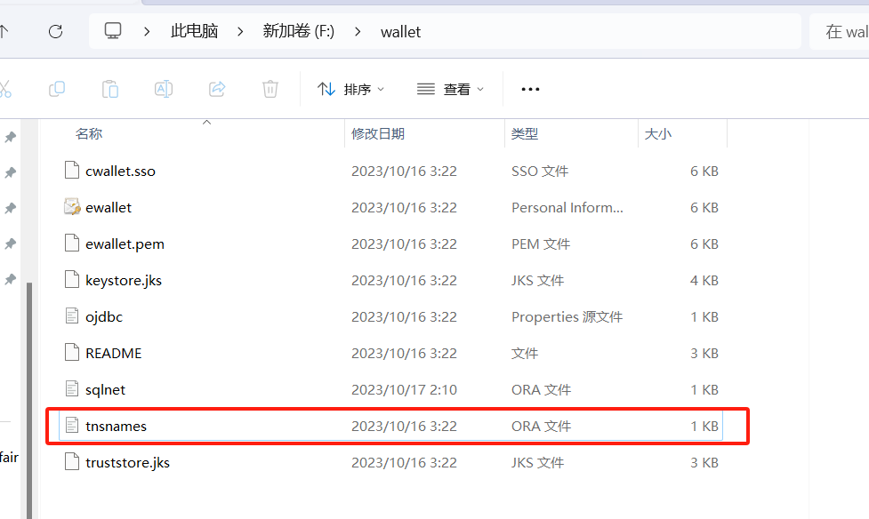

*Start the server*

Use 'app.listen' to start the server and listen on the specified port.
```javascript
app.listen(port, () => {
    console.log(`Server is running on port ${port}`);
});
```

*Static file services*

Use the 'express.static' middleware to serve static files to the public directory so that you can store HTML, CSS and JavaScript files in it and access them through your browser.
```javascript
app.use(express.static('public'));
```

3. Run the website

Run the web page by entering the following code in the terminal.
```code
node server.js
```
The results of the web page run are shown below. You can select the product name you want to search, and then you can see the product information stored in the database.
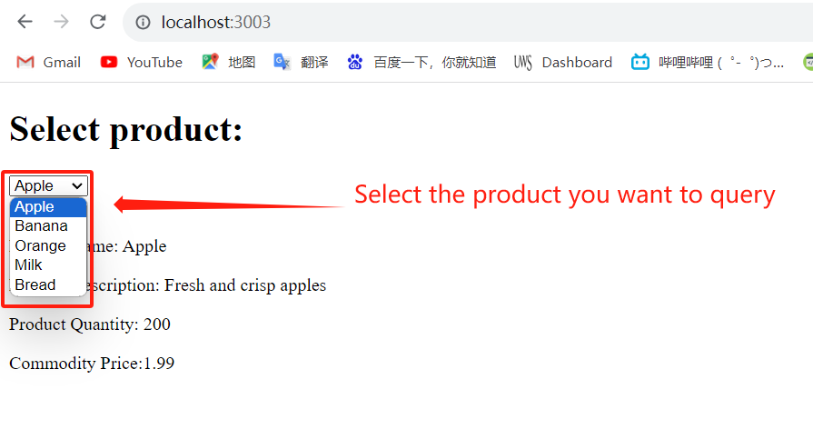

